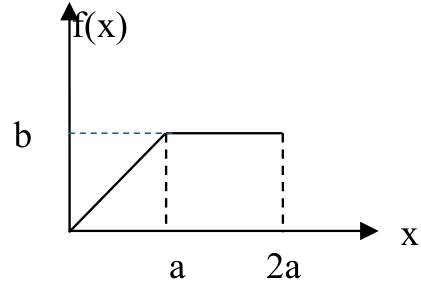

+++
title = "Computer Modelling and Simulation Fundamentals"
date = 2025-01-28
updated = 2025-01-29
description = "The basic glossary and concepts of Computer Modelling and Simulation"

[taxonomies]
tags = ["simulation",
        "Review",]

[extra]
toc = false
+++

# Overview

---

# Quiz

## Question 0x01

In order to provide realistic output, scientific models _________.

1. [ ] Incorporate all known variables in the real world
2. [ ] Must be accurate physical representations of a system
3. [ ] Use equations to describe every process within a system
4. [ ] Simplify the real world where appropriate

### Answer 0x01

{{spoiler(fixed_blur=true, text=
"4. Simplify the real world where appropriate."
)}}

## Question 0x02

Simulations in which one or more input variables are random are referred to as
______.

1. [ ] Stochastic simulation
2. [ ] Deterministic simulation
3. [ ] Discrete-event simulation
4. [ ] Dynamic simulation
5. [ ] Agent-based simulation

### Answer 0x02

{{spoiler(fixed_blur=true, text=
"1. Stochastic simulation. In Deterministic, Variables are set and fixed. In
Discrete-event, the simulation is based on discrete events (can be
deterministic or stochastic). In Dynamic, the simulation is based on continuous
time (can be deterministic or stochastic). In Agent-based, the simulation is
based on the behavior of agents (can be deterministic or stochastic)."
)}}

## Question 0x03

The ______ distribution is the only continuous distribution that has the
memoryless property. The ______. Distribution is the only discrete distribution
that possesses the memoryless property.

1. [ ] Normal – Binomial
2. [ ] Exponential – Geometric
3. [ ] Poisson – Exponential
4. [ ] Geometric – Poisson

### Answer 0x03

{{spoiler(fixed_blur=true, text=
"2. Exponential – Geometric. The memoryless property states that the
probability of an event occurring in the next time period is independent of the
time that has already elapsed. The Exponential and Geometric distributions are
the only distributions that possess this property."
)}}

## Question 0x04

A bank is an example of ____________ system, since __________________ variables
e.g., the number of customers in the bank-change only when a customer arrives
or finishes being served and departs.

1. [ ] continuous – flow
2. [ ] agent-based – state
3. [ ] discrete – flow
4. [ ] discrete – state

### Answer 0x04

{{spoiler(fixed_blur=true, text=
"4. discrete – state. In a discrete-state system, the state of the system
changes only at discrete points in time. In a discrete-flow system, the state
of the system changes continuously over time."
)}}

## Question 0x05

In the ______________________________ simulation model inputs to the simulation
are known values, while in the _____________________________ simulation model,
one or more random variables are used for input data.

### Answer 0x05

{{spoiler(fixed_blur=true, text=
"deterministic"
)}}

{{spoiler(fixed_blur=true, text=
"stochastic"
)}}

## Question 0x06

The future-event list (FEL) is typically represented by a
______________________________, which can be efficiently implemented using a
_______________________________.

### Answer 0x06

{{spoiler(fixed_blur=true, text=
"priority queue"
)}}

{{spoiler(fixed_blur=true, text=
"heap"
)}}

## Question 0x07

The exponential distribution has the memoryless property, meaning that
_________________________________________________________________________.

### Answer 0x07

{{spoiler(fixed_blur=true, text=
"the probability of an event occurring in the next time period is independent
of the time that has already elapsed."
)}}

## Question 0x08

Monte Carlo simulations calculate _________________________ probability, which
can be used as an approximation of __________________________ probability when
the number of trials is high enough.

### Answer 0x08

{{spoiler(fixed_blur=true, text=
"empirical"
)}}

{{spoiler(fixed_blur=true, text=
"theoretical"
)}}

## Question 0x09

The multiplicative congruential generator $X_{i+1} = (3X_i) \mod 2^{32}$ will
have a period of $2^{32}$. (T/F)

### Answer 0x09

{{spoiler(fixed_blur=true, text=
"False. The period of this generator is $2^{32-2}$."
)}}

## Question 0x0A

Match the Questions

1. Building the right model
2. Building the model right
3. Time to reach initial transient
4. Iterative correction procedure of model building
5. Specification of probability distributions in model building
6. If the arrival rate is not affected by the number of customers being served and waiting, the model is called

With the following answers

Infinite population model, input modeling, verification, calibration, validation, warm-up period.

### Answer 0x0A

{{spoiler(fixed_blur=true, text=
"1. Building the right model - input modeling
2. Building the model right - verification
3. Time to reach initial transient - warm-up period
4. Iterative correction procedure of model building - calibration
5. Specification of probability distributions in model building - input modeling
6. If the arrival rate is not affected by the number of customers being served and waiting, the model is called - infinite population model"
)}}

## Question 0x0B

Explain the differences between discrete-event, agent-based, and continuous
simulation paradigms.

### Answer 0x0B

{{spoiler(fixed_blur=true, text=
"Discrete-event simulation is based on discrete events, such as the arrival of
a customer at a bank or the completion of a service. Agent-based simulation is
based on the behavior of agents, such as people or animals. Continuous
simulation is based on continuous time, such as the flow of water in a river."
)}}

## Question 0x0C

What are the differences between traditional programming and agent-based
modeling approach? Give an example.

### Answer 0x0C

{{spoiler(fixed_blur=true, text=
"Traditional programming is based on algorithms, while agent-based modeling is
based on the behavior of agents. For example, a traditional program might
calculate the average number of customers in a bank, while an agent-based model
might simulate the behavior of individual customers in the bank."
)}}

## Question 0x0D

What are the main characteristics of Agent-Based Modeling? Explain and give an
example.

### Answer 0x0D

{{spoiler(fixed_blur=true, text=
"Agent-based modeling is based on the behavior of agents, such as people or
animals. Agents can interact with each other and with their environment. For
example, an agent-based model of a traffic system might simulate the behavior
of individual cars on a road, including how they interact with each other and
with traffic lights."
)}}

## Question 0x0E

Explain the differences between:

1. Dynamic simulation and static (Monte Carlo) simulation,
2. Deterministic simulation and stochastic simulation,
3. Discrete simulation and continuous simulation.

### Answer 0x0E

{{spoiler(fixed_blur=true, text=
"1. Dynamic simulation is based on continuous time, while static (Monte Carlo)
simulation is based on discrete events. For example, a dynamic simulation might
model the flow of water in a river, while a static simulation might model the
arrival of customers at a bank."
)}}

{{spoiler(fixed_blur=true, text=
"2. Deterministic simulation uses fixed input values, while stochastic
simulation uses random input values. For example, a deterministic simulation
might model the behavior of a machine with fixed parameters, while a stochastic
simulation might model the behavior of a machine with random parameters."
)}}

{{spoiler(fixed_blur=true, text=
"3. Discrete simulation is based on discrete events, such as the arrival of a
customer at a bank, while continuous simulation is based on continuous time,
such as the flow of water in a river."
)}}

## Question 0x0F

Give brief answers to the following questions:

1. What is the difference between model verification and validation?
2. Discuss why validating a model of a computer system might be easier than
   validating a military combat model. Assume that the computer system of
   interest is similar to an existing one.

### Answer 0x0F

{{spoiler(fixed_blur=true, text=
"1. Model verification is the process of ensuring that a model is correctly
implemented, while model validation is the process of ensuring that a model is
an accurate representation of the real system."
)}}

{{spoiler(fixed_blur=true, text=
"2. Validating a model of a computer system might be easier than validating a
military combat model because the computer system of interest is similar to an
existing one. This means that the model can be compared to the existing system
to ensure that it is accurate. In contrast, a military combat model might be
more difficult to validate because it is based on hypothetical scenarios that
have not yet occurred."
)}}

## Question 0x10

In a given probability density function “a” is a constant.



1. Find b in terms of a.
2. Find cdf of the variable X.
3. Find the expected value of the variable X.

### Answer 0x10

{{spoiler(fixed_blur=true, text=
"1. Find b in terms of a.
$$
\textrm{Total Area} = \frac{1}{2} a \cdot b + a \cdot b = \frac{3}{2} a \cdot b \newline
\textrm{Since } f(x) \textrm{ is a probability distribution function, } \int_{-\infty}^{\infty} f(x) dx \textrm{ must be 1. So; } \newline
\int_{-\infty}^{\infty} f(x) dx = \frac{3}{2} a \cdot b = 1 \rightarrow b = \frac{2}{3a}
$$"
)}}

{{spoiler(fixed_blur=true, text=
"2. Find cdf of the variable X.
$$
f(x) =
\begin{cases}
\frac{b}{a}x, & \text{if } 0 \leq x \leq a \newline
b, & \text{if } a \leq x \leq 2a \newline
0, & \text{o/w}
\end{cases}
$$

$$
F(x) = \int_0^x \frac{b}{a} x \,dx = \frac{b}{2a} x^2 \Big|_0^x = \frac{b}{2a} x^2, \quad \text{if } 0 \leq x \leq a
$$

$$
F(a) = \frac{ab}{2}
$$

$$
F(x) = F(a) + \int_a^x b \,dx = \frac{ab}{2} + bx \Big|_a^x = \frac{ab}{2} + bx - ab = bx - \frac{ab}{2}, \quad \text{if } a < x \leq 2a
$$

$$
F(x) =
\begin{cases}
\frac{b}{2a} x^2, & 0 \leq x \leq a \newline
bx - \frac{ab}{2}, & a < x \leq 2a \newline
1, & x > 2a
\end{cases}
$$"
)}}

{{spoiler(fixed_blur=true, text=
"3. Find the expected value of the variable X.
$$
E(x) = \int_{-\infty}^{\infty} x f(x) \,dx = \int_0^a x \frac{b}{a} x \,dx + \int_a^{2a} x b \,dx
$$

$$
= \frac{b}{3a} x^3 \Big|_0^a + \frac{b}{2} x^2 \Big|_a^{2a}
$$

$$
= \frac{ba^2}{3} + 2ba^2 - \frac{ba^2}{2} = \frac{11ba^2}{6}
$$"
)}}

## Question 0x11

For each of the systems listed, sketch the logic of an event-oriented model.
Develop the model in any language (or pseudocode):

1. A central-server queuing model: when a job leaves the CPU queue, it joins
the I/O queue with shortest length.

2. A queuing model of database system that implements fork join: a job receives
service in two parts. When it first enters the server it spends a small amount
of simulation time generating a random number of requests to disks. It then
suspends (freeing the server) until such time as all the requests it made have
finished, and then enqueues for its second phase of service, where it spends a
larger amount of simulation time, before finally exiting. Disks may serve
requests from various jobs concurrently, but serve them using FCFS ordering.
Your model should report on the statistics of a job in service – how long (on
average) it waited for phase 1, how long it waits on average for its I/O
requests to complete, and how long it waits on average for service after its
I/O requests complete.

### Answer 0x11

{{spoiler(fixed_blur=true, text=
"1. A central-server queuing model: when a job leaves the CPU queue, it joins
the I/O queue with the shortest length.
```python
from queue import PriorityQueue

class Job:
    def __init__(self, arrival_time, service_time):
        self.arrival_time = arrival_time
        self.service_time = service_time

    def __lt__(self, other):
        return self.service_time < other.service_time

class CentralServer:
    def __init__(self):
        self.cpu_queue = PriorityQueue()
        self.io_queue = PriorityQueue()

    def add_job(self, job):
        self.cpu_queue.put(job)

    def process_jobs(self):
        while not self.cpu_queue.empty():
            job = self.cpu_queue.get()
            self.io_queue.put(job)

central_server = CentralServer()
job1 = Job(0, 5)
job2 = Job(1, 3)
job3 = Job(2, 4)
central_server.add_job(job1)
central_server.add_job(job2)
central_server.add_job(job3)
central_server.process_jobs()
```
")}}

{{spoiler(fixed_blur=true, text=
"2. A queuing model of a database system that implements fork join.
```python
from queue import PriorityQueue

class Job:
    def __init__(self, arrival_time, service_time):
        self.arrival_time = arrival_time
        self.service_time = service_time

    def __lt__(self, other):
        return self.service_time < other.service_time

class DatabaseSystem:
    def __init__(self):
        self.server_queue = PriorityQueue()
        self.disk_queue = PriorityQueue()

    def add_job(self, job):
        self.server_queue.put(job)

    def process_jobs(self):
        while not self.server_queue.empty():
            job = self.server_queue.get()
            self.disk_queue.put(job)

database_system = DatabaseSystem()
job1 = Job(0, 5)
job2 = Job(1, 3)
job3 = Job(2, 4)
database_system.add_job(job1)
database_system.add_job(job2)
database_system.add_job(job3)
database_system.process_jobs()
```
")}}

## Question 0x12 to Question 0x14

MISSING

## Question 0x15

Discuss why validating a model of a computer system might be easier than
validating a military combat model. Assume that the computer system of interest
is similar to an existing one.

### Answer 0x15

{{spoiler(fixed_blur=true, text=
"A computer system simulation model is discrete, stochastic, dynamic, whereas a
military combat model is continuous, stochastic and dynamic. So, validating a
large scale military combat simulation model needs a finer (more detailed) but
small scale simulation model."
)}}

## Question 0x16

What are the differences between traditional programming and agent based
modeling approach. Give an example.

### Answer 0x16

{{spoiler(fixed_blur=true, text="
| ABM | Traditional Programming |
| --- | --- |
| Linear | Positive feedback is difficult to deal with |
| Correlation | Real mechanisms are not represented |
| Often static | Dynamics are not modeled |
| Emergence | Lower rules form patterns on higher levels |
| Self-organization | Program finds best pattern |
| Learning | Feedback is used to change behavior |
")}}

{{spoiler(fixed_blur=true, text=
"Application Example: Market
| ABM | Traditional Programming |
| --- | --- |
| Agents are located on a square grid | Agents are located on a square grid |
| They trade with their neighbours | They trade with their neighbours |
| There are two commodities: sugar and spice | There are two commodities: sugar and spice |
| All agents consume both these, but at different rates | All agents consume both these, but at different rates |
| Each agent has its own welfare function | Each agent has its own welfare function |
| Relating its relative preference for sugar or spice to the | Relating its relative preference for sugar or spice to the |
| amount it has ‘in stock’ and the amount it needs | amount it has ‘in stock’ and the amount it needs |
")}}

## Question 0x17

What are the main characteristics of Agent Based Modeling? Explain and give an
example.

### Answer 0x17

{{spoiler(fixed_blur=true, text=
"ABN is Decentralized.

- There is no single place where the `system's behavior` is specified.
- System's behavior emerges from individual behavior of individual agents.

Example: Strop-and-go in front of a traffic light by individual cars results in
wave characteristics of the traffic flow.

- Global consequences of individual behavior in a given space.

ABM supports modeling of complexity.

- If the interactions between parts are nonlinear, than the system cannot be
simply described by the sum of its parts.

Application Example: Hampton Roads Traffic

- Agent-based Modeling
  - Individual behavior of drivers
    - Conservative drivers stay on their old route
    - Degree of driving education influences the through-put
  - Merging lanes in front of bridges
  - Aggressive versus passive drivers
    - Alternative Use
  - Bridges are Agents
    - How well does a bridge feel (based on increased through-put, lower costs,
    etc.)
    - The “Bridge Agent” finds the best place to be"
)}}

---

# Recourses

- [AnyLogic in Three Days: Modeling and Simulation Textbook](https://www.anylogic.com/resources/books/free-simulation-book-and-modeling-tutorials/)
